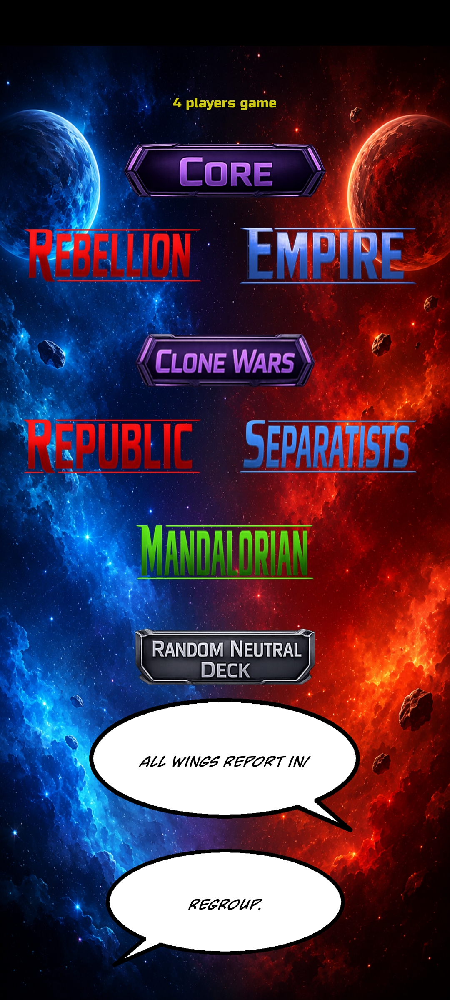
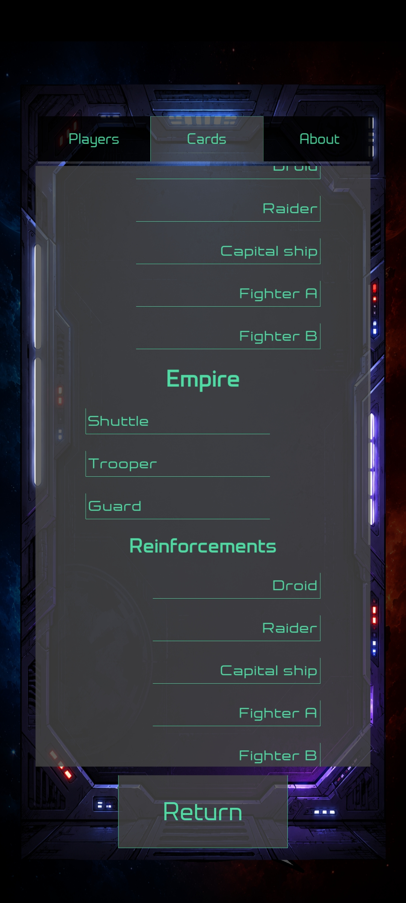
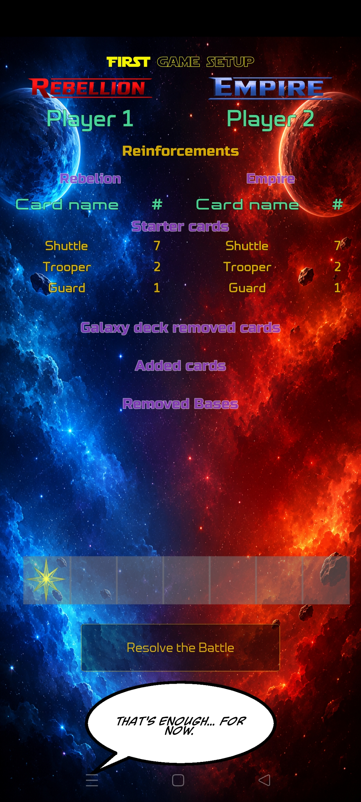

# SW:DBG Campaign Companion

Unofficial companion app for *Star Wars: The Deckbuilding Game*.

This app comprises **two main features**.

**First one** is a simple faction drawing function. The user selects:

- number of the players, from 2 to 4,
- factions to include in the draw.

The user selects entire sets or individual factions, and then indicates whether a neutral deck
should also be drawn at random (enabled by default). After this, the user will find out
which player is playing which faction and who starts the game. 

**The second mode** is Campaign Companion, in which the user selects the factions the players will use to play the campaign,
as well as their reinforcement decks. The app allows these to be combined in any way
(e.g. Separatists with Rebel reinforcements), but the user will be notified if such a combination
deviates from the rules of the game.


You can track the progress of the campaign by adding and removing cards from decks and noting destroyed bases
and Force levels between games. The app ensures that the starting decks and the Galaxy deck
contain the correct number of cards, and the user can view notifications detailing which discrepancies
must be corrected before proceeding to the next game.

In the app’s settings, you’ll find the option to change player names and starting cards for each faction.

### Summary
- 🎲 **Faction Drawing:** Supports 2-4 players with customizable sets.
- 🏆 **Campaign Companion:** Track card changes, destroyed bases, and Force levels.
- ⚠️ **Rule Validation:** Notifies you if your deck combinations deviate from game rules.
- ⚙️ **Customizable:** Change player names and starting cards in settings.

## Screenshot

<p align="center">
  
  
  
</p>

## Requirements

### For Users
- **Android:** Android 5.0 or higher (via APK)
- **Windows/Linux:** No extra requirements if using a compiled executable.

### For Developers (Running from Source)
- Python 3.8+
- Kivy

#### How to Run (Development)

1. Install dependencies:
   ```bash
   pip install -r requirements.txt
   ```
2. Run the app from location of the `main.py`.

    ```bash
    python main.py
    ```
## Installation (Android)

1. Download the `.apk` file from the [Releases](https://github.com/RapoMG/StarWarsDBG_Selector/releases/latest) section.
2. Transfer the file to your Android device.
3. Open the file on your device to install it. 
   - *Note: You may need to enable "Install from Unknown Sources" in your device settings.
## Disclaimer

This is an unofficial fan-made companion application.

Star Wars and all related names, characters, logos, and marks are property of Lucasfilm Ltd. and/or The Walt Disney Company.

This application is not affiliated with, endorsed, sponsored by, or approved by Lucasfilm Ltd., Disney, or Fantasy Flight Games.

## License

Copyright (C) 2026 Krzysztof Janiak

This project is licensed under the GNU General Public License v3.0 or later (GPL-3.0-or-later).
See the LICENSE file for details.

## Build

For Android builds, see [`commands.md`](docs/commands.md) for the Buildozer Docker commands used by this project.
