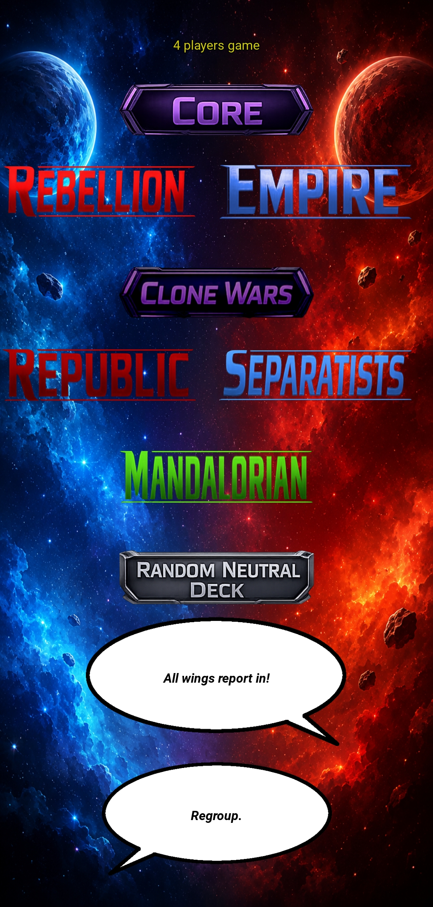

# Star Wars DBG Faction Selector

Unofficial companion app for *Star Wars: The Deckbuilding Game*.

This is a simple faction drawing app. The user selects:

- number of players, from 2 to 4
- factions to include in the draw

The app then displays the result for each player and appoints the first player.

## Screenshot

<p align="center">
  
</p>

## Requirements

- Python
- Kivy

## Run

Run the app from `main.py`.

```bash
python main.py
```

## Disclaimer

This is an unofficial fan-made companion application.

Star Wars and all related names, characters, logos, and marks are property of Lucasfilm Ltd. and/or The Walt Disney Company.

This application is not affiliated with, endorsed, sponsored by, or approved by Lucasfilm Ltd., Disney, or Fantasy Flight Games.

## Build

For Android builds, see [`commands.md`](docs/commands.md) for the Buildozer Docker commands used by this project.
